# Task 1 - Simple Web Application

Frontend + Backend + Database integration

## Application Overview

This application is a web-based student record management system developed using modern web technologies. It allows users to manage student data efficiently through a simple and responsive interface.

## Web App

### Frontend

* HTML
* Bootstrap
* Javascript(Fetch API)
  
### Backend
* PHP (REST-STYLE API)
  
### Database
* MySQL

## Features
  * Responsive user interface designed using Bootstrap
  * Backend developed using PHP for server-side processing
  * MySQL database used for storing student information
  * Ability to add new student records
  * Display all stored student details
  * Option to delete student records
  * Data exchange handled using JSON format
  * Database connectivity verification included
  
## User Interface Description
The application provides an easy-to-use dashboard where users can enter student details and view the existing student records in a structured table format

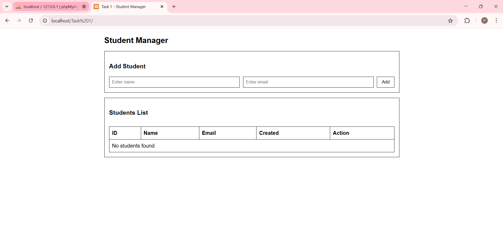
## Student Record Addition Process
When a user enters student name and email and clicks the Add button:

1. The frontend sends a POST request using Fetch API
2. The backend PHP script validates the input data
3. Valid data is inserted into the MySQL database
4. A confirmation message is displayed on the user interface
   
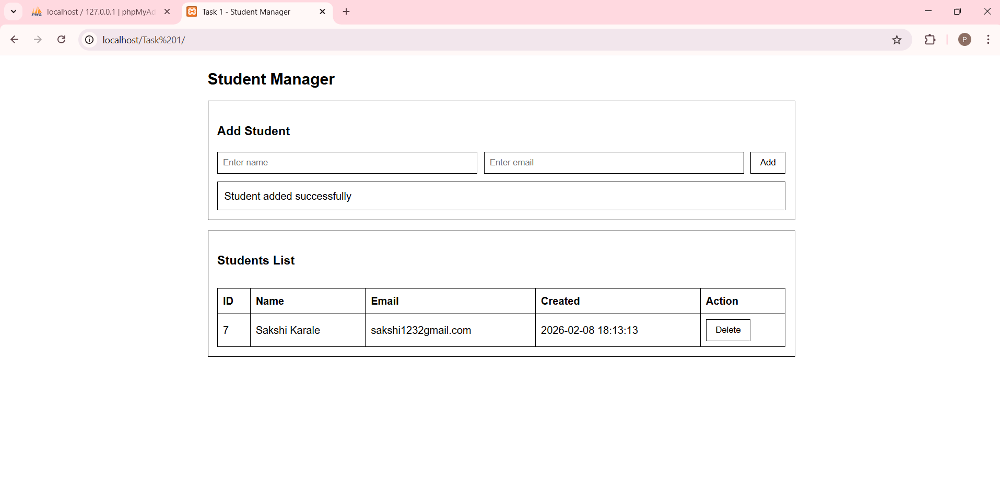
  
## Student Record Deletion Process
1. Each student entry includes a Delete option.
2. The selected student ID is sent to the backend
3. The corresponding record is removed from the database
4. The updated student list is displayed instantly without refreshing the page
  

## Database Design
Database Name: task1_db

Table Schema:

    CREATE TABLE students (
     id INT AUTO_INCREMENT PRIMARY KEY,
     name VARCHAR(100) NOT NULL,
     email VARCHAR(120) NOT NULL UNIQUE,
     created_at TIMESTAMP DEFAULT       CURRENT_TIMESTAMP
     );

# Task 2 - Docker Deployment on AWS EC2 (Amazon Linux) 

## Objective
 * Create Docker file(s)
 * Run app using Docker container
 * Expose required port
 * Ensure container auto-tart on reboot

This task i implemented on AWS EC2 instance using Docker and Docker Compose

## Technologie Used
* Amazon Linux
* Docker
* Docker Compose
* PHP (Backend)
* MySQL (Database)
* Nginx Webserver

### Step 1: Launch an AWS EC2 Instance

* AMI: Amazon Linux
* Instance Type: t3.micro
* Security Group inbound Rules
  
    * SSH - Port 22
    * HTTP - Port 80
    * Mysql - 3306
  
Connect to EC2:

    ssh -i key.pem ec2-user@<EC2_public_IP>

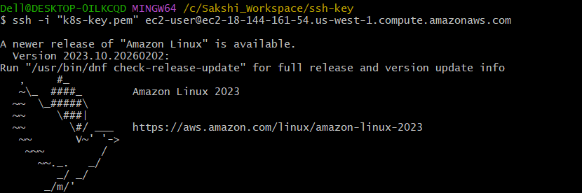

### Step 2: Install Docker on Amazon Linux
Update system:

     sudo yum update

Install Docker:

    sudo yum install docker -y

Start and Enable Docker:
   
    sudo systemctl start docker
    sudo systemctl enable docker

Verify installation:
    
     docker --version
     docker ps

 ### Step 3: Install Docker Compose (Manual Method)

 Amazon Linux does not support docker-compose-plugin via yum , so Docker Compose manually.

 Download Docker Compose:  

     sudo curl -L "https://github.com/docker/compose/releases/download/v2.29.7/docker-compose-$(uname -s)-$(uname -m)" -o /usr/local/bin/docker-compose
 Verify :

    docker-compose --version

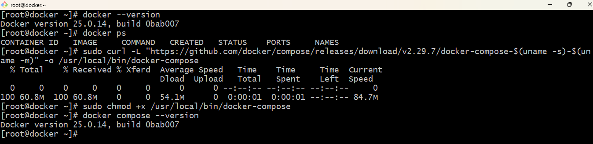

### Step 4: Create Project Directory

      mkdir docker-app-task
      cd docker-app-task
      mkdir app

Step 5: Create Dockerfile

    vim Dockerfile
    
    FROM php:8.2-apache
    RUN docker-php-ext-install mysqli
    COPY app/ /var/www/html/
    EXPOSE 80 

Build dockerfile

    docker build -t php-img .

Run the Container

    docker run -d -p 80:80 --name mycontainer php-img

Step 6: Create Application File(PHP)

Create PHP file using vim:

    <?php
    $host = getenv("DB_HOST") ?: "db";
    $user = getenv("DB_USER") ?: "root";
    $pass = getenv("DB_PASS") ?: "rootpass";
    $name = getenv("DB_NAME") ?: "studentdb";
    $conn = new mysqli($host, $user, $pass, $name);

    if ($conn->connect_error) {
     die("Database connection FAILED: " . $conn->connect_error);
    }
    echo "<h2>Database Connected Successfully!</h2>";
    ?>
   

### Step 7: Create docker-compose.yml File

     vim docker-compose.yml

     version: "3.9"
     services:
       web:
        build: .
       container_name: php_web
       ports:
        - "80:80"
       environment:
         DB_HOST: db
         DB_USER: root
         DB_PASS: rootpass
         DB_NAME: studentdb
       depends_on:
        - db
       restart: always
      db:
       image: mysql:8.0
       container_name: mysql_db
       environment:
         MYSQL_ROOT_PASSWORD: rootpass
         MYSQL_DATABASE: studentdb
       volumes:
        - mysql_data:/var/lib/mysql
       restart: always
    volumes:
      mysql_data:

### Step 8: Build and Run Containers

     docker-compose up -d --build

### Step 9: Test Application

Copy public from EC2:

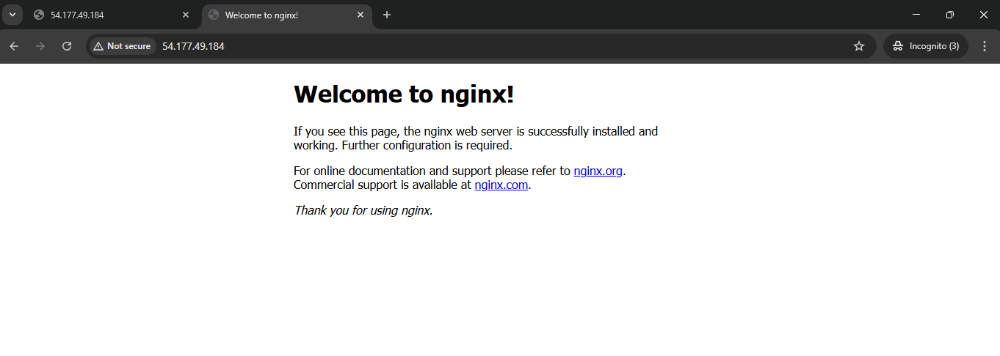

 From browse: http://<EC2_PUBLIC_IP>

 ### Step 10: Auto-Start Containers on Reboot

 Docker service enabled:

     sudo systemctl enable docker

Test:
   
       sudo reboot

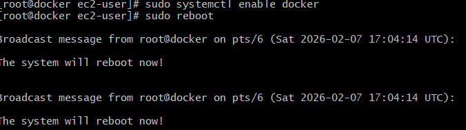

After reconnect:

     docker ps

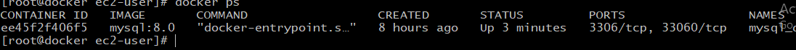

# Task 3 - Load Balancer & Auto Scaling
#### Goal:

* Create Application Load Balancer (ALB)
* Attach Auto Scaling Group (ASG)
* Scale using CPU Utilization

### Step 1: Create Launch Template

Include:
* Give it name (Example: Mytemp)
* Select AMI
* Instance type -> t3.micro
* Security group -> Allow HTTP
   
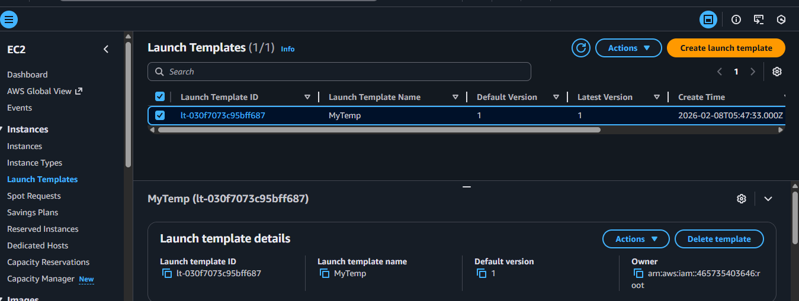
### Step 2: Create Target Group

* Select target type -> Instances
* Protocol -> HTTP
* Port -> 80
  
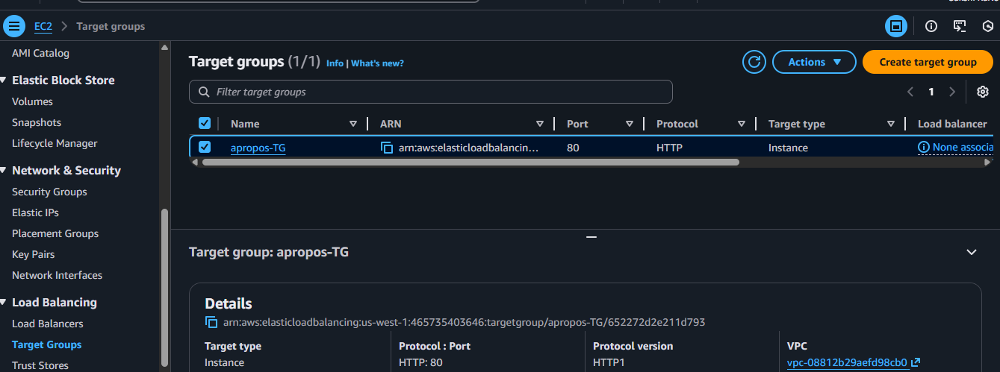
  
### Step 3: Create Application Load Balancer

* Scheme -> Internet-facing
* Listener -> HTTP:80
* Select VPC + Public Subnet
* Attach Target Group
  
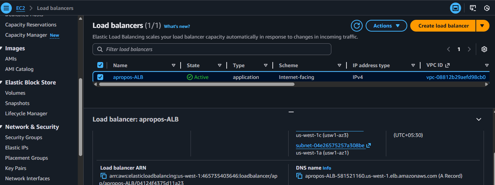

Load balancer distributes traffic across all EC2 instances automatically

### Step 4: Create Auto Scaling Group

* Attach Load Balancer -> Select Target Group
* Min -> 1
* Max -> 3
* Desired -> 1
  
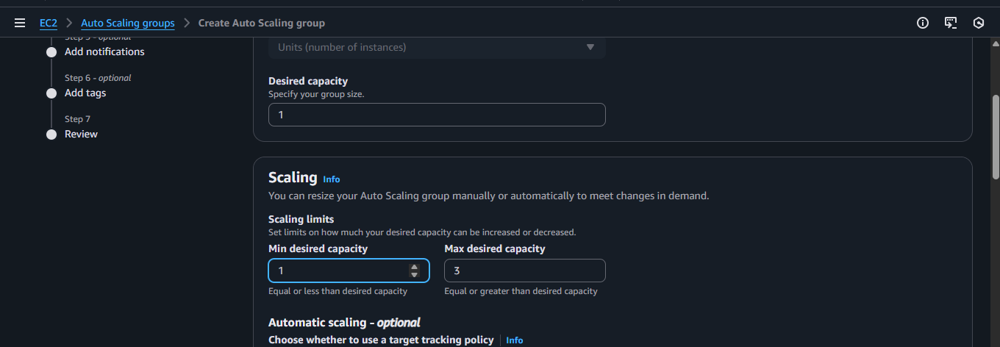

Here, ASG is Created  

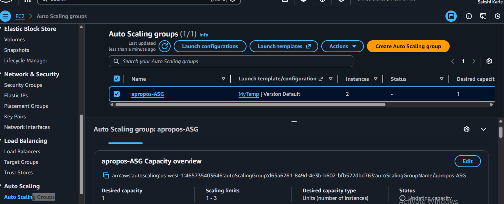

ASG automaticaly registers and deregisters instances with load balancer

### Step 5: Add CPU Scaling policy

Example

* Scale OUT: CPU > 50% -> Add instance
* Scale In: CPU < 50% -> Remove instance

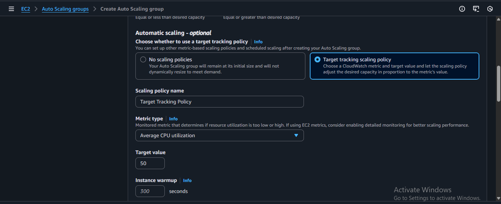

Scaling can be triggerd using CPU utilization alarms.

* Auto Scaling Group automatically launched EC2 instances based on scaling configuration
  
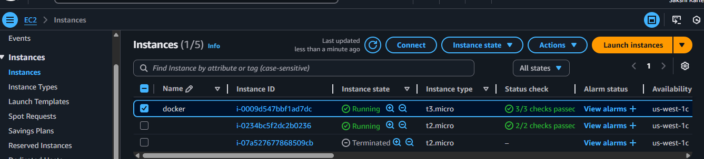

# Task 4 - Cost Optimization

#### __Use Free Tier Instances__
   * t2.micro / t3.micro
   * Only minumum instance running
  #### __Minimal Resource__
  * Stop unused instances
  * Delete unused volumes

#### __Auto Scaling to avoid over provisioning__

* Auto Scaling adjusts capacity based on usage so you pay only for what you need
* Instance added only when needed

# Task 7: Troubleshooting (Explain)
### 1 . Application Not Accessible

Possible Causes:

* Security group blocking port 80
* Container not running
* Wrong public IP
* Nginx service stopped
  
What To Check:

           docker ps

Check:

* Instance running
* Port 80 open in security group
* Public IP correct
### 2. Container Running But Port Not Reachable
Possible Causes

* Wrong Docker port mapping
* Security group issue
* Nginx not listening
  
What To Check
* Check container ports:
  
      docker ps

Check mapping:

0.0.0.0:80->80

### 3. ALB Health Check Failure

Possible Causes

* Wrong health check path
* App not returning 200 OK
* Wrong port in target group
  
What To Check

* Health check path = /
* Target group port = 80
* Instance status = Healthy
